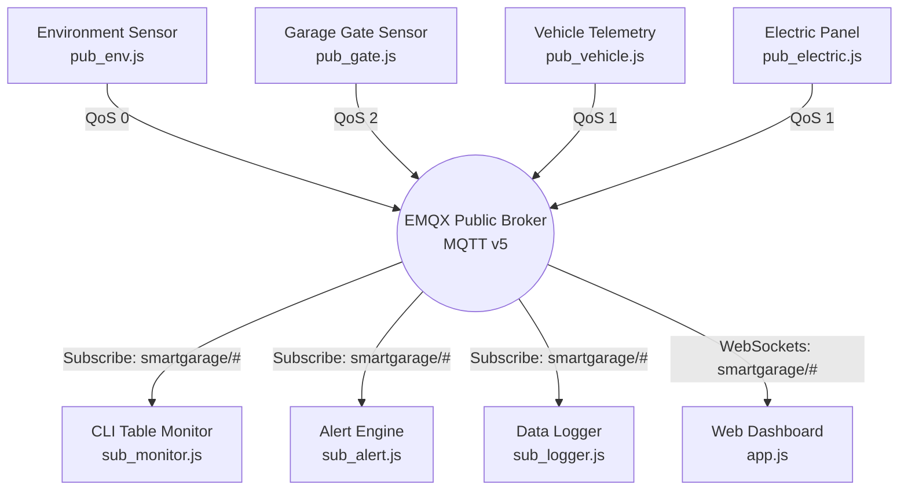
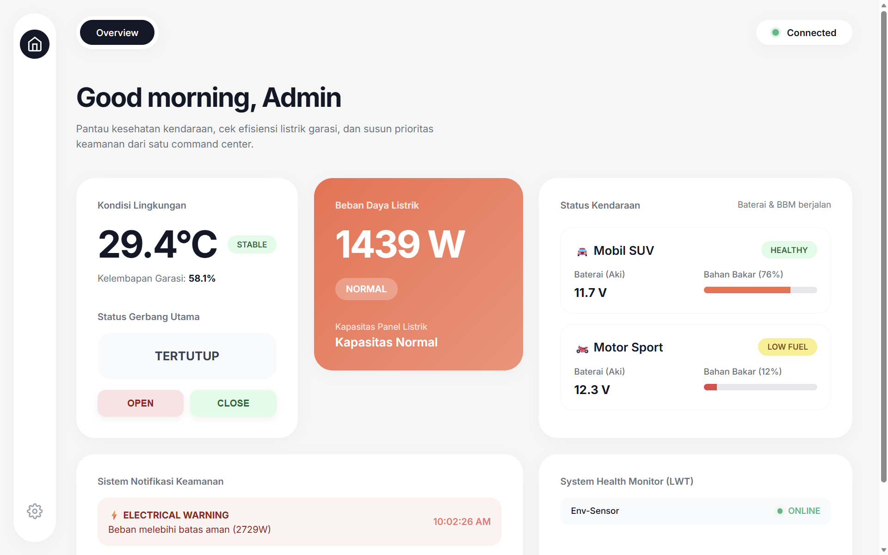

# Laporan Tugas Integrasi Sistem - MQTT

## Anggota Kelompok
| No | Nama | NRP |
|---|---|---|
| 1 | Imam Mahmud Dalil Fauzan | 5027241100 |
| 2 | Raya Ahmad Syarif | 5027241041 |

---

## Deskripsi Proyek
**"Smart Garage Monitor"** adalah sistem monitoring ekosistem garasi berbasis IoT. Proyek ini menggunakan protokol komunikasi **MQTT v5** untuk mengirimkan data secara efisien. Sistem ini memantau 4 aspek utama secara *real-time*:
1. Suhu & Kelembapan Lingkungan Garasi.
2. Keamanan Gerbang Utama.
3. Status Daya Panel Listrik.
4. Kondisi Kendaraan (Tegangan Aki dan Level BBM).

Data dikirim secara asinkron oleh 4 *Publishers* (Sensor Simulasi) yang berbeda, dan diterima secara paralel oleh 3 sistem *Subscribers* (Live Dashboard, Alert Engine, dan Data Logger).

---
## Arsitektur Sistem

---
## Design Topic (Topic Tree)
```text
smartgarage/
├── env              -> Metrik Suhu, Kelembapan, dan Status Cuaca
├── gate             -> Status Bukaan Pintu Gerbang (Opened/Closed)
├── electric         -> Data Konsumsi Daya (Load/Wattase)
└── vehicle/
    ├── Mobil_SUV    -> Status Voltase Aki & BBM SUV
    └── Motor_Sport  -> Status Voltase Aki & BBM Motor
```
---
## Implementasi 10 Fitur Utama MQTT v5

### 1. Pub/Sub Model & QoS Dinamis
* **Penjelasan:** Penggunaan Quality of Service (QoS) disesuaikan dengan urgensi data. Sensor lingkungan (`pub_env`) menggunakan **QoS 0** untuk menghemat *bandwidth*. Sensor gerbang (`pub_gate`) menggunakan **QoS 2** (*Exactly Once*) untuk menjamin status keamanan pintu tepat diterima 1 kali tanpa risiko duplikasi atau kegagalan *delivery*.

### 2. Topic Wildcards (`#`)
* **Penjelasan:** Semua sistem penerima data (seperti `sub_monitor` dan `sub_alert`) cukup berlangganan ke rute **`smartgarage/#`**. Pendekatan arsitektur ini membuat aplikasi klien sangat *scalable*. Jika ada 100 kendaraan baru  ditambahkan ke dalam broker, aplikasi pemantau otomatis mendeteksi tanpa perlu mengubah *source code*.

### 3. Efisiensi via Topic Alias
* **Penjelasan:** Diimplementasikan pada sensor suhu yang mengirim data berkecepatan tinggi tiap detik. Pada pengiriman pertama, ia meregistrasikan ID `topicAlias: 1`. Di pengiriman berikutnya, string topik yang panjang dipangkas menjadi *string* kosong (`""`). Teknik ini mampu memangkas memori *overhead header* jaringan secara masif.

### 4. User Properties (Metadata)
* **Penjelasan:** Diimplementasikan pada telemetri kendaraan (`pub_vehicle`). Informasi kritis mengenai rekomendasi perbaikan (*Maintenance-Required*) tidak diletakkan di dalam *payload* JSON, melainkan disisipkan di dalam header paket MQTT (*User Properties*). Alert Engine mampu menyaring pesan bahaya secara efisien tanpa beban proses `JSON.parse()`.

### 5. Retain Message
* **Penjelasan:** Data sensor keamanan gerbang diterbitkan dengan *flag* `retain: true`. Manfaatnya: ketika *Manager* baru membuka aplikasi Web Dashboard, MQTT Broker seketika (*zero-delay*) mendistribusikan status gerbang terakhir yang tersimpan di memori. Dashboard langsung terisi tanpa harus menunggu jadwal transmisi gerbang berikutnya.

### 6. Message Expiry Interval
* **Penjelasan:** Diimplementasikan pada status mobil. Jika mobil mengirim data saat sinyal jelek, kita set interval kedaluwarsa 30 detik. Jika pesan tersebut tersangkut di jaringan lebih dari 30 detik, Broker akan membuangnya. Hal ini mencegah eksekusi perintah telat atau *false-alert* baterai lemah yang sudah basi.

### 7. Last Will and Testament (LWT)
* **Penjelasan:** Diimplementasikan pada koneksi sensor. Jika sensor `pub_env` mendadak mati karena mati listrik (tidak sempat mengirim pesan *offline*), Broker MQTT secara otomatis akan menerbitkan pesan LWT "Offline" atas nama sensor tersebut. Dashboard dapat merespons dengan menampilkan *badge* abu-abu secara *real-time*.

### 8. Request-Response Pattern
* **Penjelasan:** Diimplementasikan untuk mengendalikan aktuator gerbang secara remote. Administrator dapat mengirim perintah *"Buka Gerbang"* ke topik khusus. Pesan perintah tersebut memuat *Response Topic* dan *Correlation Data* di headernya. Setelah gerbang terbuka, aktuator membalas *feedback* persis ke topik balasan tersebut untuk mencocokkan konfirmasi.

### 9. Shared Subscriptions (Load Balancing)
* **Penjelasan:** Diimplementasikan pada *Data Logger*. Alih-alih satu *subscriber* menanggung beban penulisan ratusan log per detik, kita menggunakan format `$share/loggergroup/smartgarage/#`. Jika kita menyalakan 3 terminal logger, Broker MQTT akan membagi-bagi pesan secara adil (Round-robin) ke 3 terminal tersebut untuk mencegah *bottleneck* I/O pada disk.

### 10. Flow Control (Backpressure)
* **Penjelasan:** Diimplementasikan pada koneksi klien *Dashboard*. Klien menginformasikan nilai `Receive Maximum` ke Broker saat inisialisasi koneksi. Hal ini mencegah browser *lag* atau *crash* jika tiba-tiba terjadi lonjakan ribuan pesan MQTT masuk secara bersamaan, memaksa broker untuk mengerem laju data sesuai kemampuan klien.

---

## Dashboard Web Monitor
Dashboard Web monitor menggunakan HTML/CSS Native (*Vanilla*). Web ini terhubung secara *real-time* dengan Broker melalui **MQTT over WebSockets**.

### Fitur Visual Dashboard:
- **Live Indicator / Badges:** Perubahan warna dinamis (*Hijau=Stable, Kuning=Warning, Merah=Danger*) untuk tiap kartu perangkat.
- **Progress Bar Bahan Bakar:** Lebar indikator baris BBM yang merespons perubahan level secara *smooth* menggunakan animasi CSS.
- **Dynamic Accent Cards:** Sebuah Card "Beban Listrik" (*Electric*) akan berubah warnanya menjadi merah jika mendeteksi peringatan *Overload Daya*.
- **Sistem Log Keamanan:** Panel notifikasi yang menangkap peringatan gerbang terbuka atau bahaya ekstrem suhu (*Fire Alert*).

### *Screenshot* Tampilan Web Dashboard:
